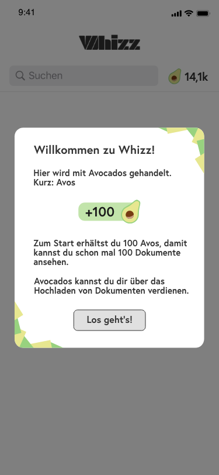

## How to use

1. Download the Expo app
2. Scan the QR code --> https://expo.io/@wilfredo789/isardigital-coding-challenge
   - Hint: when on iOS, just use the regular camera to scan the code
3. Relax and enjoy

## Download links for Expo app

- iOS --> https://apps.apple.com/us/app/expo-client/id982107779
- Android --> https://play.google.com/store/apps/details?id=host.exp.exponent

## Author

- **Wilfredo Casas**

---

# Isardigital-coding-challenge

Welcome to the Isardigital Frontend Coding challenge!
This is a simple means to get an understanding of the coding style and quality of our applicants.
You have 24 hours to complete the challenge. Please fork this repository and commit your code.

## Project

Our typical development progress starts with design specifications from our designers that are discussed in our weekly sprint meetings and assigned to our frontend developers.
You are assigned to build the sign-up info screen for our flutter app WHIZZ that informs users that they are awarded a certain number of avo points on signup:



The number of avo points should be pulled from our API for the price name: 'registration'.
Link to our API doc: https://staging.api.whizz.app/api/doc/#api-Coin-getprice  
The API Call output should look as follows:

```
{
    "status": "ok",
    "data": {
        "defaultvalue": 100,
        "_id": "5e60f901c7ba0ae0efe05ddf",
        "name": "registration",
        "displayname": "Registrierung",
        "datetime_created": "2020-03-05T13:05:05.525Z",
        "__v": 0,
        "id": "5e60f901c7ba0ae0efe05ddf"
    }
}
```

Please use the key: defaultvalue for the display as shown in the screen.

Please only build the popup in a default flutter app that should be activated based on a buttonpress. Do not build the Whizz homescreen.  
The border images are extra credit only.

Have fun and feel free to reach out if something is not clear!
